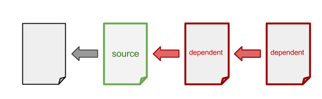

# gulp-resolve-dependents
This plugin resolve dependents of the source file.


## Example
```javascript
var gulp = require('gulp'),
    sass = require('gulp-sass'),
    path = require('path'),
    resolveDependents = require('gulp-resolve-dependents');

function sassResolver(filePath, fileContents){
  var match, result = [],
      pattern = /import "(.+?)";/mg;
  while((match = pattern.exec(fileContents)) !== null){
    result.push(path.resolve(path.dirname(filePath), match[1]));
  }
  return result;
}

gulp.task('default', function(){
    gulp.src('./src/lib/example.scss')
    .pipe(resolveDependents({
          files: './src/**/*.scss',
          resolver: sassResolver,
          basePath: './src'
    }))
    .pipe(sass())
    .pipe(gulp.dest('./dest/css'));
});
```

## API
### resolveDependents(option)
### option.files (required)
Type: String
Project files.

### option.resolver (required)
Type: Function(filePath: String, fileContents: String): Array<String>
A function that resolve file dependencies. 

### option.basePath (optional)
Type: String Default: proeces.cwd
This value is used to set base path of vinyl file and resolve reference path.

### option.includeSource (optional)
Type: Boolean Default: true
If set to false, resolveDependents does not push files that was passed from the pipe.
